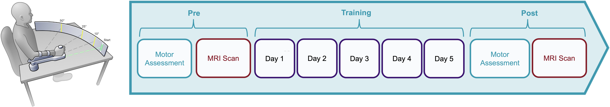

# DegenerationConnectivity
Code for analysing functional connectivity of cerebellar degeneration patients for manuscript [Nettekoven et al., 2024](https://doi.org/10.1101/2024.07.05.602300).

## Dataset information
The data files available in this repository were derived from MRI scans of 40 patients diagnosed with pure cerebellar cortical degeneration and 40 age and sex-matched neurologically healthy individuals. All individuals participated a five-day motor training. On the days before and after training, participants underwent a structural MRI scan and a functional resting-state scan in addition to a motor assessment. 



Functional data is missing for (subject, timepoint):
- sub-57, post
- sub-70, pre
- sub-70, post

Structural data was acquired from all subjects.


## Notebooks / Code to replicate different sections of the paper

Dependencies for all code sections: see ```requirements.txt``` (run pip install -r requirements to install all required packages into your environment)

### Study demographics
Study demographics, demographics for template generation and validation sample (Supplementary Table 1), and demographics for FIX training datasets
```notebooks/demographics.ipynb```

### Study-specific template
Fissure distances in template, SUIT and MNI space was calculated using:
```scripts/compare_fissures.py```

Fissure overlap was plotted (Fig 1B-D) and compared using:
```notebooks/stats_template.ipynb```

FIX performance with template registrations and standard registrations was plotted (Fig 1E) and evaluated using:
```notebooks/stats_fix.ipynb```

The study-specific template and associated files can be found in the [DegenerationControlTemplate](https://github.com/carobellum/DegenerationControlTemplate) repository.

### Connectivity

#### Extracting ROI timecourses

ROI timecourses were extracted from functional data in native space using:
```scripts/seed_ts.sh```

#### Correlating ROI timecourses

Functional connectivity between timecourses was calculated using:
```scripts/seed_corr.py```

#### Statistical analysis of functional connectivity
Data was loaded from dataframes, normalized and brought into the correct shape for analysis using:
```r/data_connectivity.R```

Baseline connectivity differences were plotted (Fig 3A & 3B) using:
```r/plots_connectivity.R```

Connectivity change was plotted (Fig 4, 5, 6 & 7) using:
```notebooks/plots_connectivity_change.ipynb```

Statistical tests on functional connectivity were calculated using:
```r/stats.R```

Model assumptions were tested using:
```r/model_assumptions.R```

Connectivity results were plotted using:
```r/plots_connectivity.R``` 

